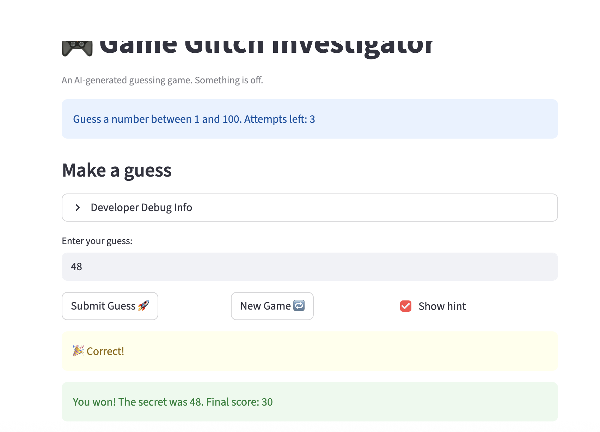
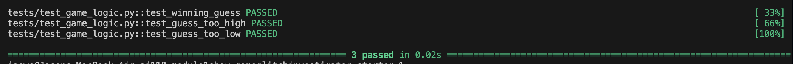

# 🎮 Game Glitch Investigator: The Impossible Guesser

## 🚨 The Situation

You asked an AI to build a simple "Number Guessing Game" using Streamlit.
It wrote the code, ran away, and now the game is unplayable. 

- You can't win.
- The hints lie to you.
- The secret number seems to have commitment issues.

## 🛠️ Setup

1. Install dependencies: `pip install -r requirements.txt`
2. Run the broken app: `python -m streamlit run app.py`

## 🕵️‍♂️ Your Mission

1. **Play the game.** Open the "Developer Debug Info" tab in the app to see the secret number. Try to win.
2. **Find the State Bug.** Why does the secret number change every time you click "Submit"? Ask ChatGPT: *"How do I keep a variable from resetting in Streamlit when I click a button?"*
3. **Fix the Logic.** The hints ("Higher/Lower") are wrong. Fix them.
4. **Refactor & Test.** - Move the logic into `logic_utils.py`.
   - Run `pytest` in your terminal.
   - Keep fixing until all tests pass!

## 📝 Document Your Experience

**Game Purpose:**
A number guessing game built with Streamlit where the player tries to guess a secret number within a limited number of attempts. The difficulty setting controls the number range and attempt limit. The player receives hints after each guess and earns points for winning quickly.

**Bugs Found:**
1. Hints were backwards — "Too High" told the player to go higher, and "Too Low" told them to go lower.
2. On even-numbered attempts, the secret was converted to a string, causing wrong comparisons (e.g. guessing 100 showed "Go Higher" even when the secret was lower).
3. The attempt counter started at 1 instead of 0, making attempts left display one less than the real count.
4. Invalid guesses (non-numbers) consumed an attempt before the fix.
5. No upper or lower bound validation — guesses above 100 or below 0 were accepted.
6. The New Game button did not reset `status`, `score`, or `history`, and always used the 1–100 range regardless of difficulty.
7. The win score formula used `attempt_number + 1`, giving less points than intended.
8. "Too High" on even attempts incorrectly added +5 to the score instead of deducting.
9. Switching difficulty did not restart the game.
10. The attempts-left banner rendered before the submit logic, so it always showed a stale count.

**Fixes Applied:**
- Swapped the hint messages in `check_guess` so "Too High" → "Go LOWER" and "Too Low" → "Go HIGHER".
- Removed the even/odd string conversion of the secret so comparisons always use integers.
- Initialized `st.session_state.attempts` to `0`.
- Moved `attempts += 1` inside the valid-guess branch so invalid inputs don't waste a turn.
- Added `elif guess_int > 100` and `elif guess_int < 0` validation checks.
- Fixed New Game to reset `status`, `score`, `history`, and use `random.randint(low, high)`.
- Fixed win score formula from `100 - 10 * (attempt_number + 1)` to `100 - 10 * attempt_number`.
- Removed the even/odd branch in `update_score` so wrong guesses always deduct 5 points.
- Added difficulty change detection using `st.session_state.difficulty` to auto-restart the game.
- Used `st.empty()` placeholder filled after the submit block so the attempt counter is always current.
- Refactored all logic functions into `logic_utils.py` and added inline regression tests.

## 📸 Demo

<!-- Add a screenshot of your fixed, winning game below -->

## 📸 Challenge 1: pytest Results

<!-- Add a screenshot of your pytest terminal output below -->

## 🚀 Stretch Features

- [ ] [If you choose to complete Challenge 4, insert a screenshot of your Enhanced Game UI here]
